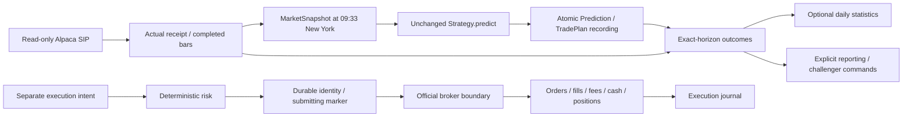

# Runtime cleanup handoff

## Actual architecture

There is no research-plan-to-live bridge or enabled LIVE trading loop. This task
preserves that boundary instead of adding a trading feature.

## Changes and concrete fixes

- Replaced impossible minute-end availability and exact floating-point scheduler
  equality with a 09:33 New York cutoff and 30-second capture window. All consumed
  data still arrived by the cutoff; no receipt timestamps are relabeled.
- Intraday completed-bar ends can precede decision time by at most 120 seconds;
  symbol and benchmark ends must align. Daily-bar timing stays separate.
- Delayed-bar outcomes measure from the decision-minute open rather than an earlier
  feature close, excluding predecision price moves. Existing exactly aligned and
  daily entries retain their prior contract; outcome metadata records the model.
- Lifetime research lock now precedes state writes. QQQ/IWM predictions commit in
  one explicit transaction; a tested mid-batch crash rolls back both symbols.
- Only due unresolved forecasts trigger resolution; the whole growing resolved
  history is no longer imported every poll.
- Optional learned-selector failure preserves predictions with NO_TRADE plans.
  Optional daily learner/report failures leave durable predictions/outcomes intact.
  Removed automatic weekly challenger generation/evaluation/promotion and recursive
  credential/report/journal scanning from the unattended worker. Explicit research
  commands and the diagnostic helper remain available.
- Broker recovery rejects duplicate IDs, conflicting broker/client references,
  unowned active orders and divergent observed terminal state.
- Windows lifetime anchors use Linux flock to prevent orphan-wrapper restarts
  from accumulating extra helpers. It remains a WSL support task, never a trading owner.
- Rewrote runtime documentation around actual behavior and SHADOW operation.

Numerical strategy/feature sources, parameters, risk limits, learner formulas,
promotion rules, broker contracts and vendor bytes are unchanged. Exact reviewed
timing-only hashes preserve read compatibility without editing registered versions.
No package reshuffle or additional audit layer was introduced.

## Ownership, modes and state

`tradeagent-prospective.service` is the single shadow-runtime owner.
`TradeAgentProspectiveWSL` only keeps WSL alive. The kernel owns process locks;
stale filenames do not require deletion. Legacy SUPERVISED/CANARY approval controls
remain isolated compatibility workflows, not additional top-level operational modes.

Revised data/configuration uses fresh `work/prospective-v2`; original
`work/prospective` is retained. Configuration markers prohibit silent state reuse.
Both experience and collection databases remain on supported local Linux storage.
No historical or synthetic records are imported into prospective state.

Effective duplicate suppression uses immutable prediction identities and persisted
execution signal/account/version identities with unique client references. Submitting
markers and approval consumption commit before I/O. Crashes and ambiguous responses
reconcile without blind replay; missing/ambiguous broker records halt. Partial fills
stay pending. Fill reconciliation verifies quantities, actual fees, cash and holdings.
This is effective idempotency/recovery, not formal distributed exactly-once delivery.

## Observed baseline and verification

The starting branch was `rsi-v0.2`, clean at
`e400c5dc69abe83523d1a09d92225a9139632b4d`. Baseline inspection at
2026-10-07 14:55 America/Chicago was during the regular XNYS session. The installed
service was retrying with no worker PID; its encrypted market-data credential file
was absent. No authentication was weakened or credential contents opened/decrypted.

Pre-refactor authenticated baseline: **blocked by unavailable encrypted credentials**.
Post-refactor authenticated smoke: **unverified for the same blocker**; by the later
inspection the regular market session had also ended. No fresh live snapshot,
strategy signal, SIP entitlement or connectivity result is fabricated.
Baseline evidence: `work/runtime-cleanup/baseline.json` and `baseline-tests.txt`.

Real broker account reads/reviews/placements/cancellations in this task:
**0 / 0 / 0 / 0**. Authenticated market-data requests: **0**.
Execution lifecycle tests invoke synthetic brokers only.

Baseline full suite: **586 passed in 44.52 seconds**. First focused run found old
timing expectations; crash injection subsequently exposed a real partial-commit bug.
That failure was fixed rather than hidden. Final observed validation and receipts
will be recorded below and in `work/runtime-cleanup/`.

## Completion record

Final full suite: **600 passed in 48.62 seconds**, including the final execution-only
receipt label clarification; all original 586 tests are retained, with 14 additional
critical scenarios/cases. Ruff lint/format, compile/import, pip dependency checks, source/
wheel builds, Twine, provenance/manifest/project checks, contract validation and
Git whitespace checks passed. Fresh source and built-wheel prediction demos matched
exactly; the preserved synthetic execution simulation and both inspections passed.

The existing systemd unit now targets `work/prospective-v2`; encrypted-credential
loading still fails before worker startup, with no market-data request. Native
Task Scheduler commands updated the lifetime action after RemoteSigned blocked
network-path script invocation. No policy change was made. Five redundant bare
sleep helpers (including superseded restart attempts) were removed after identity
checks. Exactly one flock/sleep pair remained; a duplicate-anchor probe returned 1.

Fresh prospective state: seven strategies/versions; **zero predictions, outcomes,
learner runs, lessons, challengers and promotions**. Both DB integrity checks are
ok; experience foreign-key violations are zero. Original prospective state remains
seven versions and zero predictions/outcomes/learning/challengers/promotions.
Next eligible target: **2026-10-08 09:33 EDT / 08:33 America/Chicago / 13:33 UTC**.
This is conditional on credentials and fresh available market data.

Implementation commit: `b59ee13ac196dc3c3ffe51c98ebfa3d520139cc8`,
pushed to existing branch `rsi-v0.2` through the configured origin. GitHub redirects
the existing remote to [TradeAgent](https://github.com/danielye0010/TradeAgent).
No remote identity, visibility or unrelated user work was changed.

Both exact-commit CI runs passed: [push CI](https://github.com/danielye0010/TradeAgent/actions/runs/37683827091)
and [draft-PR CI](https://github.com/danielye0010/TradeAgent/actions/runs/37683827280).
Python 3.12, 3.13 and 3.14 tests/demos, quality and package jobs all succeeded.
Existing [PR #1](https://github.com/danielye0010/TradeAgent/pull/1) remains draft,
open and unmerged. The implementation checkout was clean after push.

This handoff completion is a separate documentation commit; the exact final HEAD,
verified remote equality, final working-tree state and its CI result are recorded
in `work/runtime-cleanup/completion.json`. It changes no runtime source.
Current systemd MainPID is zero while encrypted credential loading is blocked;
the cold status report is a readiness receipt, not proof of an active worker. Detailed completion evidence belongs in
`work/runtime-cleanup/validation.json`, `supervision.json` and `completion.json`.
Runtime databases, credentials, private receipts and test logs remain Git-ignored.
The execution validation receipt explicitly calls its scheduler field
`execution_scheduler`, avoiding a false claim that shadow supervision is absent.

## Remaining limits and next step

The REST latest-snapshot collector can miss a minute after a long outage; missing
paths remain unresolved. First-observed immutable bars do not claim final corrected
vendor bars. Physical power/sleep recovery, real SIP availability, fresh prospective
signals/outcomes and real broker execution remain unverified. Research plans do not
automatically create broker intents; no new bridge was added.

**Single next step:** provision the encrypted market-data credential using the
existing hidden WSL setup, then observe the first eligible 09:33 New York shadow
capture and one-hour outcome with zero broker writes. Do not backfill a missed session.
