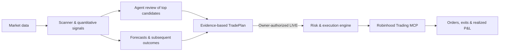

# TradeAgent

**Agent-driven market research. Deterministic trade execution.**

TradeAgent combines US stock and ETF scanning, model-assisted opportunity analysis, quantitative trading strategies, and Robinhood execution in one workflow. The agent investigates market opportunities; the Python engine measures signals, evaluates trading costs, and manages orders and exits.

[](https://github.com/danielye0010/TradeAgent/actions/workflows/ci.yml)

[](LICENSE)

[How it works](#how-it-works) · [Run the agent](#run-the-agent) · [Quick start](#quick-start) · [Strategies](#strategies) · [Documentation](#documentation)

> The current agent-to-LIVE implementation is on [`feat/tradeplan-engine`](https://github.com/danielye0010/TradeAgent/tree/feat/tradeplan-engine); `main` still contains an earlier code baseline.

## How it works



- **Scan:** analyze a configurable universe of 31 US stocks and ETFs; record systematic forecasts across the available universe.
- **Research:** the agent reviews up to three shortlisted opportunities using observed price action, volume, relative strength, and relevant news.
- **Decide:** combine the agent's research with prior resolved quantitative evidence and estimated trading costs to produce a `TradePlan` or `NO_TRADE`.
- **Execute:** an eligible, explicitly authorized LIVE plan enters the existing Robinhood order lifecycle, with position limits, exit management, reconciliation, and recovery.
- **Learn from outcomes:** resolve forecasts against later market observations; track research returns separately from broker-confirmed P&L.

### Where the agent runs

**The model runs in Codex, not inside the Python trading engine.** Codex loads the repository's [`trade-opportunity-analyst` Skill](.agents/skills/trade-opportunity-analyst/SKILL.md), calls TradeAgent CLI tools, researches the shortlisted securities, and saves structured assessments. No separate OpenAI API key or LLM service is required for this Skill workflow.

| Component | Role |
| --- | --- |
| [`trade-opportunity-analyst/SKILL.md`](.agents/skills/trade-opportunity-analyst/SKILL.md) | Agent instructions, research sequence, RESEARCH/LIVE modes |
| [`opportunity_cli.py`](src/tradeagent/opportunity_cli.py) | Scanner, assessment, decision, and execution commands |
| [`alpha_signals.py`](src/tradeagent/research/alpha_signals.py) | Deterministic quantitative signals |
| [`opportunity_workflow.py`](src/tradeagent/research/opportunity_workflow.py) | Frozen assessments, economic evidence, and outcome tracking |
| [`opportunity_live.py`](src/tradeagent/opportunity_live.py) | Handoff to the existing live trading engine |

The manual agent runs when invoked in Codex. An optional daily SHADOW timer invokes a bounded, tool-free Codex CLI assessment and freezes four independent research arms; Python owns collection, decisions and outcomes. It never schedules LIVE orders. See [daily research](docs/prospective-shadow.md#daily-opportunity-research). The optional `codex_bridge.py` is a broker-MCP transport adapter, not the market-research model.

## Run the agent

Open Codex in the checkout. The same Skill supports three explicit modes.

**RESEARCH** — scan, investigate, and record a trading decision without placing orders.

```text
$trade-opportunity-analyst Analyze today's market opportunities and generate a TradePlan.
```

**LIVE** — show a purchase plan, execute only if eligible, then track exit and actual P&L.

```text
$trade-opportunity-analyst LIVE: Analyze today's market; show the purchase plan; if eligible, execute through Robinhood, manage the exit, and report realized P&L.
```

LIVE uses the owner's existing private configuration and authorized symbols. If economic or execution requirements are not met, it returns `NO_TRADE`. The LIVE invocation is interactive and owner-initiated, not an unattended trading schedule.

**EXPERIMENTAL LIVE** — explore predefined quantitative long signals with the owner's
existing $5 sizing and at most one new entry attempt per trading day. It retains all
broker/risk/recovery protection and records unvalidated results separately. Ordinary
LIVE retains its evidence gates; experimental mode requires an explicit owner request.
See the [policy and exact invocation](docs/opportunity-workflow.md#explicit-experimental-policy).

## Quick start

Python 3.12–3.14 on Linux or Ubuntu/WSL2.

```bash
git clone --branch feat/tradeplan-engine https://github.com/danielye0010/TradeAgent.git
cd TradeAgent

python3 -m venv .venv
source .venv/bin/activate
python -m pip install -e ".[dev]"
```

Run the research pipeline offline, without a brokerage account:

```bash
tradeagent demo --demo-dir data/demo
tradeagent inspect --state-dir data/demo
```

For direct CLI operation:

```bash
tradeagent opportunity scan --candidates 3
tradeagent opportunity evidence --template
# Save a completed assessment as assessment.json
tradeagent opportunity assess --input assessment.json
tradeagent opportunity decide --refresh
tradeagent opportunity show
```

The commands do not invoke an AI model on their own: agent analysis takes place in the Codex session. LIVE trading additionally requires a configured Robinhood connection; see [live execution](docs/one-shot.md).

## Strategies

| Strategy | Hypothesis |
| --- | --- |
| **Opening continuation** | Opening momentum aligned with the gap and market |
| **Stabilized reversal** | Reversal after a strong opening move |
| **Residual strength** | Price strength relative to the broader market |

Daily SHADOW research compares Quant Only, Codex Only, Quant + Codex and a seeded Random baseline over shared market observations. No repeatable net trading edge has yet been established; see [research results](docs/alpha-findings.md).

## Documentation

[Opportunity workflow](docs/opportunity-workflow.md) · [Getting started](docs/getting-started.md) · [Architecture](docs/architecture.md) · [Live execution](docs/one-shot.md) · [Shadow trading](docs/prospective-shadow.md)

## Development

```bash
pytest -q
ruff check src tests scripts
ruff format --check src tests scripts
```

## License

[Apache 2.0](LICENSE). [Third-party licenses](THIRD_PARTY.md).

TradeAgent is an independent project, not affiliated with Robinhood Markets, Inc. Trading involves risk of loss.
