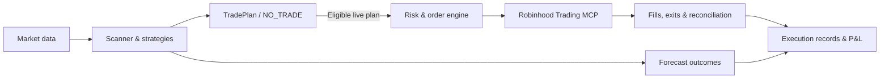

# TradeAgent

**Open-source quantitative trading, from market signals to live execution.**

TradeAgent scans US stocks and ETFs, evaluates intraday trading strategies, tracks realized market outcomes, and executes eligible trade plans through Robinhood Trading MCP.

[](https://github.com/danielye0010/TradeAgent/actions/workflows/ci.yml)

[](LICENSE)

[Overview](#overview) · [Quick start](#quick-start) · [Trading workflow](#trading-workflow) · [Architecture](#architecture) · [Documentation](#documentation)

> Latest trading workflow: [`feat/tradeplan-engine`](https://github.com/danielye0010/TradeAgent/tree/feat/tradeplan-engine). The default branch retains the earlier code baseline.

## Overview

- **Market discovery** — scan a configurable universe of US equities and ETFs (31 by default), rank opportunities, and retain signals across the full universe.
- **Systematic strategies** — evaluate opening continuation, intraday reversal, and market-relative strength using timestamped prices and observed bid/ask spreads.
- **Measured outcomes** — resolve forecasts against subsequent market data and compare strategies using realized returns, trading costs, and comparable historical observations.
- **Live trading** — turn eligible plans into Robinhood equity orders with owner-defined symbols, dollar or share sizing, and portfolio risk limits.
- **Durable execution** — journal orders, track fills, manage exits, reconcile positions and cash, and recover interrupted runs.

The system can return `NO_TRADE` when no opportunity meets its requirements.

## Architecture



Research, broker access, and order management are separate components. The execution engine manages order identity, portfolio limits, position exits, and recovery.

## Quick start

Requires Python 3.12–3.14 on Linux or Ubuntu/WSL2.

```bash
git clone --branch feat/tradeplan-engine https://github.com/danielye0010/TradeAgent.git
cd TradeAgent

python3 -m venv .venv
source .venv/bin/activate
python -m pip install -e ".[dev]"
```

Run a complete offline research demonstration without a brokerage account:

```bash
tradeagent demo --demo-dir data/demo
tradeagent inspect --state-dir data/demo
```

## Trading workflow

### 1. Scan and evaluate

```bash
tradeagent opportunity scan --candidates 3
tradeagent opportunity evidence --template
```

Complete the candidate assessment, then record the decision:

```bash
tradeagent opportunity assess --input assessment.json
tradeagent opportunity decide --refresh
tradeagent opportunity show
tradeagent opportunity compare
```

The scanner records quantitative forecasts across all available symbols, while the shortlist focuses detailed review on the highest-ranked opportunities. Subsequent market observations resolve matured predictions. Research records are stored locally in `data/opportunities/`.

### 2. Execute an eligible plan

With an existing owner-configured Robinhood connection and a valid decision:

```bash
tradeagent opportunity execute \
  --decision-id <DECISION_ID> \
  --config /path/to/tradeagent.toml \
  --live
```

This command may place real orders. It displays the purchase plan before submission, refreshes market and account checks, and runs the existing entry/exit lifecycle. The authorized trading universe and order budget come from the owner's private configuration.

### 3. Inspect performance

```bash
tradeagent opportunity show
tradeagent opportunity compare
```

Market-modeled outcomes and broker-confirmed P&L are recorded separately.

## Strategies

| Strategy | Signal |
| --- | --- |
| **Opening continuation** | Momentum aligned with the opening gap and broader market |
| **Stabilized reversal** | A strong opening move followed by short-term reversal |
| **Residual strength** | Price movement relative to the broader market |

These are active research hypotheses. The [published experiment](docs/alpha-findings.md) has not established a repeatable net trading edge.

## Project structure

```text
src/tradeagent/research/           Signals, TradePlans, forecasts and outcomes
src/tradeagent/prospective/        Market-data collection and shadow trading
src/tradeagent/opportunity_live.py Opportunity-to-execution workflow
src/tradeagent/oneshot.py          Broker orders, exits and reconciliation
tests/                             Research and execution tests
```

## Documentation

[Getting started](docs/getting-started.md) ·
[Trading workflow](docs/opportunity-workflow.md) ·
[Architecture](docs/architecture.md) ·
[Live execution](docs/one-shot.md) ·
[Shadow trading](docs/prospective-shadow.md)

## Development

```bash
pytest -q
ruff check src tests scripts
ruff format --check src tests scripts
```

## License

[Apache 2.0](LICENSE). See [third-party licenses](THIRD_PARTY.md).

TradeAgent is independent of Robinhood Markets, Inc. Trading involves risk of loss.
