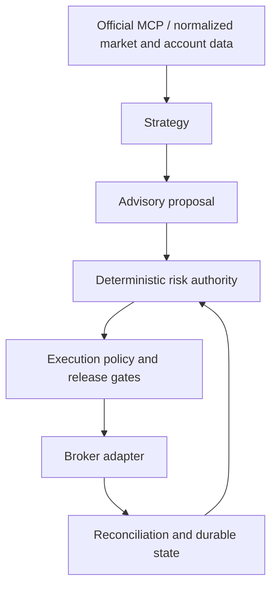

# Robinhood Agent

A safety-oriented trading agent for Robinhood's official Trading MCP, with deterministic risk controls, durable execution state, and staged deployment.

[](LICENSE)

## Why this project

Broker access alone does not make an agent reliable. A strategy proposes a trade; deterministic risk checks, signed execution policy, durable submission identity, and reconciliation decide whether it can proceed. This project provides that infrastructure. The bundled EMA strategy is an engineering example, not a proven investment strategy.

## Features

- A synthetic demo that needs no account, credentials, or money.
- Official MCP integration and one-shot real-data SHADOW evaluation.
- Separate strategy, risk, execution policy, and broker adapters.
- Durable journals, fenced leases, and duplicate submission protection.
- Recovery paths for interrupted execution and uncertain broker responses.
- Signed, bounded deployment controls for deliberate equity releases.

## How it works



Strategy output has no direct route to broker execution.

## Quick start: no account required

Use Linux or Ubuntu on WSL2, with the checkout on a local Linux filesystem. Python 3.11 or newer is required; see [environment support](docs/getting-started.md#environment).

```bash
git clone https://github.com/danielye0010/robinhood-agent-public.git
cd robinhood-agent-public
python3 -m venv .venv
source .venv/bin/activate
python -m pip install -e ".[dev]"

robinhood-agent validate
robinhood-agent simulate --demo-dir data/demo
robinhood-agent inspect --config data/demo/inspect.example.json
```

The demo creates synthetic equity and option fills, suppresses a duplicate decision, and writes a summary to `data/demo/demonstration.json`. No broker connection is made. Use a **new** demo directory on each run; prior evidence is never overwritten. [Getting started](docs/getting-started.md) explains the output and customization.

The repository is currently private; cloning requires access. There is no published PyPI package.

## Connect Robinhood

The optional real-data path uses Codex CLI and its native Robinhood OAuth connection. Credentials stay with the authentication provider, outside this repository. Connect and authenticate personally, then check the guarded connection and run a one-shot SHADOW cycle. Follow [Connect the official MCP](docs/getting-started.md#connect-the-official-mcp) before doing so.

## Operating modes

| Stage | What it does | Real broker writes |
| --- | --- | --- |
| Simulation | Synthetic fills, journals, and duplicate suppression | None |
| SHADOW | Real account/market reads and hypothetical decisions | None |
| Supervised / canary | Equity lifecycle with exact approval or bounded signed policy | Requires a deliberate release and enrolled verification key |
| Limited autonomous equity | Reusable signed limits and strict classification/reconciliation | Gated; no default live release |

## Current status

Simulation and real-data SHADOW are supported. Real equity execution infrastructure is implemented but fails closed without an enrolled key and valid deployment policy. Live options and unattended production are not supported by default. [Deployment](docs/deployment.md#current-state) is the authoritative status and release guide.

## Documentation

- [Getting started](docs/getting-started.md): installation, demo, configuration, and connection.
- [Architecture](docs/architecture.md): transport, risk, state, and execution boundaries.
- [Safety](docs/safety.md): invariants and failure handling.
- [Deployment](docs/deployment.md): stages, release requirements, and recovery.

## Contributing

See [CONTRIBUTING.md](CONTRIBUTING.md) for local checks and change expectations, and [SECURITY.md](SECURITY.md) for sensitive reports. Original project code is licensed under [Apache-2.0](LICENSE); vendored components retain their [MIT notices](THIRD_PARTY.md).

## Trading risk

Trading can lose money. Simulation demonstrates infrastructure behavior, not profitability or live readiness. Review the code, limits, and operational requirements before connecting an account. This independent project is not affiliated with or endorsed by Robinhood Markets, Inc.
