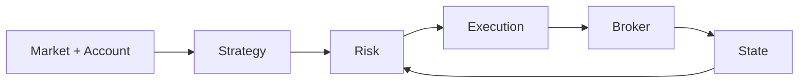

# TradeAgent

Open-source Python trading agent with deterministic risk controls,
shadow trading, durable execution state, and broker reconciliation.

[Getting Started](docs/getting-started.md) ·
[Architecture](docs/architecture.md) ·
[Deployment](docs/deployment.md)

TradeAgent supports local simulation, live-market shadow trading, and
controlled equity execution. The current broker integration uses
Robinhood's official Trading MCP.

## Quick Start

```bash
git clone https://github.com/danielye0010/tradeagent.git
cd tradeagent

python3 -m venv .venv
source .venv/bin/activate
python -m pip install -e ".[dev]"

tradeagent simulate --demo-dir data/demo
tradeagent inspect --config data/demo/inspect.example.json
```

This runs a complete synthetic trading cycle locally. No brokerage account is required.

Use Python 3.12–3.14 on Linux or Ubuntu on WSL2. Keep the checkout and runtime
state on a local Linux filesystem. See [Getting Started](docs/getting-started.md)
for installation and configuration.

## Features

- Local equity and options simulation
- Live-market shadow trading
- Deterministic portfolio and order risk controls
- Persistent SQLite execution state
- Duplicate-order protection and recovery
- Broker reconciliation after interrupted submissions
- Controlled live equity execution

## Architecture



Strategies generate trade proposals. Risk checks validate account, market, and
portfolio limits before execution. Orders and broker state are persisted for
reconciliation and recovery. See [Architecture](docs/architecture.md) for the modules.

## Broker Integration

The current broker integration uses Robinhood's official Trading MCP.

See [Getting Started](docs/getting-started.md#connect-robinhood) for connection
and shadow-mode setup.

## Operating Modes

Simulation runs locally with synthetic brokers. Shadow mode reads live data and
records decisions without sending orders. Real equity execution requires a signed
approval or policy and an enrolled public verification key. The default is shadow
mode; production keys are not enrolled. Live options are not supported.

See [Deployment](docs/deployment.md) for supervised, canary, and limited autonomous
equity operation. The included EMA strategy is an example with no established live
performance record.

## Shadow Trading

Shadow trading reads live account and market data and records decisions without
sending orders. After [connecting the broker](docs/getting-started.md#connect-robinhood), run:

```bash
tradeagent shadow
tradeagent inspect
```

See [Safety](docs/safety.md) for deterministic risk controls and broker reconciliation.

## Development

Install with `python -m pip install -e ".[dev]"`, then run:

```bash
python -m pytest -q
ruff check src tests scripts
ruff format --check src tests scripts
python -m build
```

Tests and CI use synthetic brokers. See [Contributing](CONTRIBUTING.md) for the
full checks and [Security](SECURITY.md) for sensitive reports.

## License

Original code is licensed under [Apache-2.0](LICENSE). Reused components retain
their [MIT licenses](THIRD_PARTY.md). Trading involves risk and can lose money.

TradeAgent is an independent project and is not affiliated with or endorsed by Robinhood Markets, Inc.
