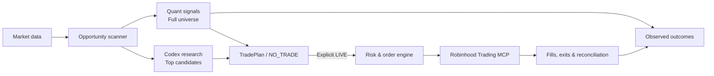

# TradeAgent

**An open-source trading agent for market research and live execution.**

TradeAgent scans US stocks and ETFs, combines quantitative signals with Codex research, and turns eligible opportunities into trade plans and Robinhood orders. Research, execution, and observed outcomes share one workflow.

[](https://github.com/danielye0010/TradeAgent/actions/workflows/ci.yml)

[](LICENSE)

[Quick start](#quick-start) · [Codex workflow](#codex-workflow) · [Architecture](#architecture) · [Research](#research-and-results) · [Documentation](#documentation)

> The latest Codex research-to-LIVE workflow is on [`feat/tradeplan-engine`](https://github.com/danielye0010/TradeAgent/tree/feat/tradeplan-engine). The default `main` branch is an earlier baseline.

## Why TradeAgent?

- **Scan broadly, investigate selectively.** Track quantitative signals across a configurable universe of 31 US stocks and ETFs; use Codex to investigate up to three candidates in depth.
- **Make decisions with evidence.** Compare Quant Only, Codex Only, and Quant + Codex on frozen market observations, realized subsequent returns, and trading costs.
- **Go from plan to execution.** An explicit LIVE Skill invocation presents an owner-sized purchase plan and sends eligible equity orders through the existing Robinhood engine.
- **Keep a complete trading record.** Persist forecasts, decisions, broker-confirmed fills, exits, reconciliation, and realized P&L. Later market observations resolve pending research outcomes.

A valid decision can also be **NO_TRADE**. The system does not turn a market anomaly or an AI opinion into an automatic buy.

## Architecture



Market data and strategy evaluation are separate from account access and order placement. The execution engine owns risk checks, order identity, position management, and recovery.

## Quick start

Python 3.12–3.14 on Linux or Ubuntu/WSL2.

```bash
git clone --branch feat/tradeplan-engine https://github.com/danielye0010/TradeAgent.git
cd TradeAgent
python3 -m venv .venv
source .venv/bin/activate
python -m pip install -e ".[dev]"
```

Explore the complete research loop offline, without a brokerage account:

```bash
tradeagent demo --demo-dir data/demo
tradeagent inspect --state-dir data/demo
```

## Codex workflow

Open Codex in the repository. One Skill provides two modes.

**RESEARCH — analyze and save a decision, without placing orders:**

```text
$trade-opportunity-analyst 分析今天的交易机会，生成 TradePlan。
```

**LIVE — generate a purchase plan and execute if it qualifies:**

```text
$trade-opportunity-analyst LIVE：分析今天的市场机会，输出购买计划，符合全部条件就通过 Robinhood 真实下单，并完成退出和盈亏记录。
```

The LIVE workflow uses the owner's existing private configuration, authorized symbol list, and risk limits. It submits an order only when a prospective TradePlan passes the economic and execution checks. Otherwise it returns `NO_TRADE`. LIVE requires a configured Robinhood connection; see [one-shot execution](https://github.com/danielye0010/TradeAgent/blob/feat/tradeplan-engine/docs/one-shot.md) and the [opportunity workflow](https://github.com/danielye0010/TradeAgent/blob/feat/tradeplan-engine/docs/opportunity-workflow.md).

For a quick view of recorded decisions and strategy comparisons:

```bash
tradeagent opportunity show
tradeagent opportunity compare
```

Research data and immutable decision records live under the ignored local `data/opportunities/` directory.

## Research and results

Three frozen intraday hypotheses currently power opportunity forecasts:

| Strategy | Hypothesis |
| --- | --- |
| **Opening continuation** | Opening momentum continues when aligned with the gap and broader market. |
| **Stabilized reversal** | A strong opening move may reverse when short-term price action turns. |
| **Residual strength** | Relative strength after accounting for broad-market movement may persist. |

The scanner records predictions across the full universe; Codex examines a smaller shortlist. Later observations update matched comparisons, keeping modeled research returns separate from actual broker P&L.

**Current research status:** No repeatable net trading edge has been established. Evidence-gated LIVE decisions require sufficiently comparable prior prospective outcomes and a positive conservative return estimate after stressed costs. See [alpha findings](https://github.com/danielye0010/TradeAgent/blob/feat/tradeplan-engine/docs/alpha-findings.md) and the [research protocol](https://github.com/danielye0010/TradeAgent/blob/feat/tradeplan-engine/docs/opportunity-workflow.md).

## Project structure

```text
.agents/skills/trade-opportunity-analyst/  Codex research and LIVE interface
src/tradeagent/research/                 Signals, TradePlans, evidence, outcomes
src/tradeagent/prospective/              Live market-data collection and SHADOW
src/tradeagent/opportunity_live.py       Research-to-execution orchestration
src/tradeagent/oneshot.py                Owner-operated broker lifecycle
tests/                                   Offline research and execution tests
```

## Documentation

[Getting started](https://github.com/danielye0010/TradeAgent/blob/feat/tradeplan-engine/docs/getting-started.md) · [Opportunity workflow](https://github.com/danielye0010/TradeAgent/blob/feat/tradeplan-engine/docs/opportunity-workflow.md) · [Architecture](https://github.com/danielye0010/TradeAgent/blob/feat/tradeplan-engine/docs/architecture.md) · [Live execution](https://github.com/danielye0010/TradeAgent/blob/feat/tradeplan-engine/docs/one-shot.md) · [Shadow trading](https://github.com/danielye0010/TradeAgent/blob/feat/tradeplan-engine/docs/prospective-shadow.md)

## Development

```bash
pytest -q
ruff check src tests scripts
ruff format --check src tests scripts
```

See [Contributing](CONTRIBUTING.md) for development conventions.

## License

[Apache 2.0](LICENSE). Vendored components retain their respective licenses; see [THIRD_PARTY.md](THIRD_PARTY.md).

TradeAgent is independent of Robinhood Markets, Inc. Trading involves risk of loss.
