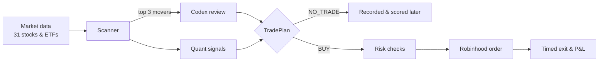

# TradeAgent

**An AI analyst picks the trade. A deterministic engine places it.**

TradeAgent scans US stocks and ETFs, asks a coding agent (Codex) to sanity-check the most
interesting moves, runs the survivors through cost-aware quantitative checks, and trades
them on Robinhood with automatic exits. Every forecast is written down before the market
answers, so you can see which picks were right after the fact.

[](https://github.com/danielye0010/TradeAgent/actions/workflows/ci.yml)

[](LICENSE)

[How it works](#how-it-works) · [Quick start](#quick-start) · [Trading modes](#trading-modes) · [Daily autopilot](#daily-autopilot) · [Strategies](#strategies) · [Docs](#documentation)

## How it works



The split is deliberate. **The model decides what is worth a look; it never touches the
broker.** Sizing, risk limits, order placement, exits and reconciliation all live in
plain Python that behaves the same way every time.

A typical trading day:

| Time (ET) | What happens |
| --- | --- |
| 10:00 | Pull fresh bars and quotes, rank the most unusual moves |
| 10:01 | Codex reviews the top three and returns *long*, *watch* or *avoid* |
| 10:02 | Quant signals and cost estimates are frozen into a decision |
| 10:05 | Entry window opens for an eligible plan |
| 11:05 | Position is closed on schedule |
| 17:00 | Every forecast, traded or not, is scored against what actually happened |

## Quick start

You need Python 3.12+ on Linux (WSL2 works fine).

```bash
git clone https://github.com/danielye0010/TradeAgent.git
cd TradeAgent
python3 -m venv .venv && source .venv/bin/activate
pip install -e ".[dev]"
```

Two things you can run right away, no accounts needed:

```bash
# Simulated strategy lab: predictions, outcomes, learning and challengers on synthetic data
tradeagent demo --demo-dir data/demo
tradeagent inspect --state-dir data/demo

# A full buy-and-sell round trip against a simulated broker
tradeagent run-once --paper --state-dir data/paper
```

### Connect market data

Scanning live markets uses the official
[Robinhood Trading MCP](https://robinhood.com/us/en/support/articles/agentic-trading-overview/).
TradeAgent never sees your password. You provide a small helper executable that prints a
token, and TradeAgent calls it when it needs one:

```json
{"access_token": "...", "expires_at": 1767225600, "resource": "https://agent.robinhood.com/mcp/trading"}
```

Put it at `~/.local/libexec/robinhood-mcp-oauth-helper` (or pass `--oauth-helper`).
Details are in the [helper contract](docs/prospective-shadow.md#robinhood-setup).
Prefer Alpaca for data? Add `--provider alpaca` to `scan`.

Then try a research pass by hand:

```bash
tradeagent opportunity scan --candidates 3     # rank today's unusual movers
tradeagent opportunity evidence --template     # the form Codex fills in
tradeagent opportunity decide --refresh        # freeze a TradePlan or NO_TRADE
tradeagent opportunity show
```

## Trading modes

Open [Codex](https://github.com/openai/codex) in the repo and talk to the
`trade-opportunity-analyst` skill. It runs the commands above for you, reads the news
for each candidate, and explains its reasoning.

| Mode | Say this | What happens |
| --- | --- | --- |
| **Research** | `$trade-opportunity-analyst Analyze today's market and generate a TradePlan.` | Full analysis, no orders |
| **Live** | `$trade-opportunity-analyst LIVE: analyze today's market, show the purchase plan, execute if eligible, and report P&L.` | Trades only when the strategy has a statistically proven edge for that setup |
| **Experimental live** | `$trade-opportunity-analyst EXPERIMENTAL LIVE: trade today's strongest quant signal with my $5 setting.` | One $5 position per day on the best quant signal, so you can learn from real fills |

Live and experimental modes both use the same execution engine and your private config:

```toml
[live]
enabled = true
symbols = ["QQQ", "IWM", "AAPL", "MSFT"]   # what the agent is allowed to buy
state_dir = "/abs/path/to/state"
max_notional = "25"

[broker]
oauth_helper = "/abs/path/to/robinhood-mcp-oauth-helper"

[entry]
order_type = "market"
dollar_amount = "5"
```

Before the first live trade, run `tradeagent live-check --config tradeagent.toml`. It reads
your account, quotes and permissions without placing anything. Drop a file named `KILL` in
`state_dir` at any time to close the position and stop. The full config reference is in
[Live execution](docs/one-shot.md).

## Daily autopilot

One command installs a systemd timer that runs the research loop every trading day, with
no chat window involved:

```bash
python scripts/install_shadow.py --daily \
  --python "$PWD/.venv/bin/python" \
  --state-dir /abs/path/to/daily-research
```

At 10:00 ET it scans the market and asks Codex (via `codex exec`, logged in with your
ChatGPT account) to rank the top three candidates from the price and volume data. Then it
records four competing picks:

| Arm | How it picks |
| --- | --- |
| **Quant only** | Strongest quantitative signal |
| **Codex only** | Codex's top-ranked *long* |
| **Quant + Codex** | Best name that both agree on |
| **Random** | A seeded coin flip among the same candidates, or cash |

Results land in `daily-status.json`. The random arm is the one to beat: if the agent can't
outpick a coin flip over a few months, you'll know. The autopilot paper-trades only; real
orders always come from one of the modes above.

## Strategies

Three intraday hypotheses, each evaluated on 5-minute-delayed entries with a one-hour hold:

| Strategy | The bet |
| --- | --- |
| **Opening continuation** | A strong open that agrees with the gap and the market keeps going |
| **Stabilized reversal** | A big opening move that starts to stall is about to retrace |
| **Residual strength** | A stock outrunning the market on a beta-adjusted basis keeps outrunning it |

Trading costs (spread, slippage and fees) are subtracted before anything counts as a win.
Bearish signals are recorded but never shorted.

**Where things stand:** no strategy has shown a repeatable edge yet. The early numbers are
in [Alpha findings](docs/alpha-findings.md), and the daily autopilot exists to change that
answer with real data.

## Project layout

```text
.agents/skills/trade-opportunity-analyst/   the Codex skill
src/tradeagent/
  research/       scanner, signals, TradePlans, outcome tracking
  prospective/    daily autopilot and market-data providers
  oneshot.py      live entry/exit engine
  risk.py         position, exposure and cash limits
scripts/          systemd installers
docs/             design notes and operating guides
```

## Documentation

- [Opportunity workflow](docs/opportunity-workflow.md): every command and how decisions are made
- [Live execution](docs/one-shot.md): config reference, recovery, kill switch
- [Daily autopilot and shadow trading](docs/prospective-shadow.md)
- [Architecture](docs/architecture.md)
- [Alpha findings](docs/alpha-findings.md)

## Development

```bash
pytest -q
ruff check src tests scripts
ruff format --check src tests scripts
```

The test suite uses synthetic markets and a mock broker, so it runs offline in about two
minutes.

## License

[Apache 2.0](LICENSE), with some vendored MIT components ([details](THIRD_PARTY.md)).

TradeAgent is an independent project and is not affiliated with Robinhood Markets, Inc.
Trading involves risk of loss.
