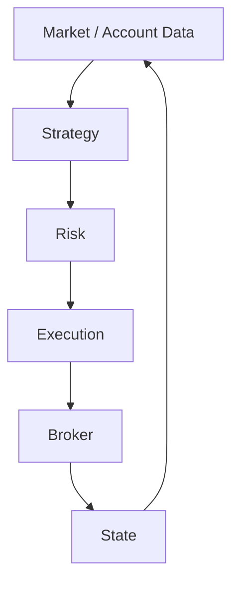

# Architecture

The agent reads broker data, produces trade proposals, checks risk, executes approved orders, and reconciles the results.

Strategies produce trade proposals. Risk checks account state, market conditions, and portfolio limits before execution can submit an order. Orders and reconciliation results are stored in SQLite.

## MCP client

[codex_bridge.py](../src/robinhood_agent/codex_bridge.py) connects through Codex app-server and its native OAuth session. It checks the official endpoint, tool annotations, and [pinned contracts](../src/robinhood_agent/contracts/official-1.6.2.json).

[standalone_mcp.py](../src/robinhood_agent/standalone_mcp.py) implements Streamable HTTP using an external OAuth helper. It handles protocol/session negotiation and validates tool inputs and outputs. Both clients feed the broker adapter.

## Broker normalization

[broker.py](../src/robinhood_agent/broker.py) collects paginated responses and converts accounts, cash, positions, orders, quotes, fills, and fees into shared types. Strategy, risk, and reconciliation use these normalized objects. Unknown schemas or inconsistent data stop the run.

## Strategy

[strategy.py](../src/robinhood_agent/strategy.py) defines the strategy interface and the included EMA trend example. Strategies receive completed market bars and propose an instrument, side, quantity, and price. The proposal goes to risk checks before execution.

## Risk

[risk.py](../src/robinhood_agent/risk.py) checks account eligibility, unleveraged cash, reserves, exposure, concentration, turnover, losses, exchange session, tradability, spread, and data freshness. [accounting.py](../src/robinhood_agent/accounting.py) tracks portfolio baselines and cash movements.

## Execution

[supervised.py](../src/robinhood_agent/supervised.py) implements review, exact approval binding, submission, and reconciliation. [policy.py](../src/robinhood_agent/policy.py) verifies signed account, deployment, config, strategy, risk, schema, and universe limits. [autonomous.py](../src/robinhood_agent/autonomous.py) reuses the lifecycle for policy-controlled execution; [standalone.py](../src/robinhood_agent/standalone.py) runs it through the direct client.

Submission identity and authorization consumption are persisted before the broker request. A canary tracks separate opening and exit allowances.

## Persistence

[state.py](../src/robinhood_agent/state.py) stores runs, intents, approvals, and events in SQLite. An OS process lock and a fenced database lease coordinate workers. JSONL is an export of the SQLite journal.

`docs/deployment_manifest.json` records the deployed file hashes. Policy checks the manifest and signed deployment hash before real execution. Changing deployed files requires a new manifest and matching signed policy.

## Reconciliation

The execution lifecycle matches broker orders to persisted submission references and reconciles fills, fees, cash, and positions. An acknowledgement is not a fill. An uncertain submission remains unresolved until broker state can be matched; it is not automatically sent again.

See [Safety](safety.md) for failure handling and [Deployment](deployment.md) for operating modes.
