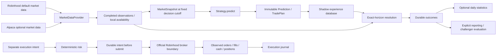

# Architecture

Default: Robinhood market data + Robinhood execution. Optional: Alpaca market data
+ Robinhood execution. Provider selection is explicit; there is no silent fallback.

The installed production owner is the prospective SHADOW service. The execution
substrate is separately callable and has no automatic research-to-broker bridge.

There is one runtime owner: `tradeagent-prospective.service`. Its lifetime research
lock is acquired before deployment/database writes and excludes both a second
service invocation and input-file research commands on the same state. The Windows
`TradeAgentProspectiveWSL` task holds a separate `flock` around WSL lifetime support;
it never launches a trading loop. Lock-file presence is not ownership: the kernel
releases OS locks after process exit.

The operational mode is SHADOW with separate health and blocker fields. There is
no enabled LIVE loop. Legacy SUPERVISED/CANARY approval states belong to the separate
execution workflows and are retained for compatibility, not promoted to global modes.

## Package boundaries

- `strategy.py`: account-free `Strategy.predict(MarketSnapshot, created_at)` interface;
  five initial families plus null/random controls. Strategies can abstain.
- `research/domain.py`, `market.py`: deeply immutable records, timestamps and
  deterministic completed-bar features. Input provenance is recorded; truthful vendor
  timestamps remain a data-provider responsibility.
- `research/store.py`: normalized SQLite experience schema, migration version and
  append-only SQL triggers. `experience.sqlite3` is separate from v0.1 `state.sqlite3`.
- `prospective/providers.py`: isolated official Robinhood/default and optional Alpaca adapters.
- `prospective/collector.py`, `service.py`: shared completed observations, calendar decisions,
  bounded capture, atomic two-symbol prediction commits and pending-only resolution.
- `research/lab.py`: contemporaneous one-shot capture. All enabled nonrejected and
  nonretired versions predict, including challengers and former champions. Predictions,
  selections, plans and quote snapshots commit together.
- `research/outcomes.py`: deterministic exact-horizon path resolution, benchmark
  residuals, excursions, volatility and traceable observation IDs.
- `research/expressions.py`: NO_TRADE, long underlying, long call/put plans and
  conservative option counterfactuals. No broker sizing or order placement.
- `research/attribution.py`: immutable numerical diagnostics; unavailable observations
  are explicit. See [Research protocol](research-protocol.md).
- `research/learning.py`, `selector.py`: decayed, shrunk version/regime statistics;
  prior-state-only transparent ranking and a raw-score comparator.
- `research/reporting.py`, `feedback.py`: generation/regime and selector comparisons;
  externally reconciled execution feedback and independent append-only fill attribution.
- `research/evolution.py`: agent proposals or deterministic threshold hypotheses,
  immutable parent/child versions, frozen paired evaluation and durable decisions.
- `research/agent_market.py`: future input boundary with zero live weight.
- `broker.py`, `options.py`, `supervised.py`, `state.py`, `risk.py`, `accounting.py`,
  `schema.py`, `codex_bridge.py`, `standalone_mcp.py`: preserved execution substrate.
- `legacy/`: v0.1 EMA proposals, signed deployment policy, canary/autonomous wrappers,
  standalone orchestration and old CLI. These are outside the default research path.

## Prediction and information integrity

A Prediction records ID, exact strategy/version, snapshot ID, symbol, UTC decision
time, horizon seconds, direction (-1/0/+1), expected return, coarse confidence,
deeply immutable features/context, distribution metadata and creation/model version.
Initial distributions are explicitly uncalibrated point estimates with historical
bar-volatility metadata, not fitted probabilities.

Version parameters and implementation SHA-256 are immutable. A source change fails
closed for existing registered versions. Strategy code changes need an explicit
version migration; daily learning never rewrites source.

Bars have start/end/availability times; quotes and session references have their own
times. Future, stale, overlapping, unfinished or misaligned bars/quotes fail capture.
Intraday signal bars may finish up to 120 seconds before decision time; symbol and
benchmark last ends must match. Decision time remains distinct from bar end and
actual receipt/creation time.
The scan clock is system time in the CLI: historical files cannot masquerade as
contemporaneous predictions. Replay and synthetic pools never enter prospective
selector state or promotion evidence. Known future observations block a backdated scan.

Every mutable champion pointer requires an explicit promotion record. Daily state and
lessons are appended as revisions. Former champions and losing experiments remain
queryable. Local operator access is not a tamper-proof remote evidence service.

## Responsibility split

Agents interpret numerical attribution, reason about regimes, propose hypotheses and
choose high-level research priorities. `evolve-weekly --proposal` imports a human/agent
JSON hypothesis and constrained parameters. No LLM service is called automatically.

Quant code owns features, returns, residuals, counterfactuals, score updates, clustering,
calibration diagnostics and evaluation decisions. Narratives cannot replace facts.
Execution code owns risk bounds, durable order identity, broker requests, fills and
reconciliation. There is no LLM-to-order path. The unattended shadow collector never
creates, evaluates or promotes challengers; those operations require explicit commands.
Daily learner failure is recorded after outcomes commit. Status-file I/O failure is
recorded without stopping collection. Database corruption, unknown evidence pools
and execution uncertainty still fail closed.

The strategy/feature numerical sources and parameters are unchanged. Exact reviewed
timing-only implementation hashes allow existing registered versions to be read without
rewriting their immutable records; unknown implementation drift still halts.

## Persistence and migration

Experience schema version 1 uses `PRAGMA user_version` and `schema_migrations`, with
transactional DDL and FULL synchronous commits. Normalized tables include strategies,
strategy_versions, market_snapshots, predictions, observations, option_observations,
outcomes, selections, trade_plans, shadow_expressions, live_expressions, live_attributions,
counterfactuals, attributions, learning_runs, strategy_scores, regime_scores, lessons,
mutations, challenger_evaluations, promotions, rejections and retirements.

Only strategy enabled/champion metadata is mutable. SQL UPDATE/DELETE and replacement guards protect
the other research records. Foreign keys and timing/identity triggers bind predictions
to snapshots and versions and ensure outcomes follow prediction creation.

v0.1 journals are not opened or migrated by research operations. Start a new research
directory; there is no scientifically defensible conversion of old EMA execution
events into prospective Predictions. Unknown/unversioned experience schemas halt
rather than rewriting data. Execution tables and recovery remain unchanged.

Research commands use an OS process lock and transaction boundaries. Execution keeps
its existing process lock plus fenced lease. Both databases require supported persistent local Linux storage. The prospective
service owns collection scheduling; explicit research and legacy execution commands
remain operator-controlled.

Execution guarantees effective duplicate suppression and reconciliation, not formal
distributed exactly-once delivery. Persisted signal/account/version identity has a
unique client reference. Approval consumption and the submitting marker commit before
network I/O. Prepared/reviewed abandoned attempts are never replayed automatically;
submitting/unknown/pending attempts must match observed broker identity. Missing
broker records, conflicting references, duplicate IDs, divergent terminal states and
unowned active orders halt. Partial fills remain pending until observed resolution.
Fill reconciliation separately checks quantity, fees, positions and cash; risk gates
keep unknown exposure and invalid quantities fail-closed.

Optional learned-selector metadata failure preserves valid shadow predictions and
records an unavailable-selection rationale with NO_TRADE plans. Strategy identity,
snapshot validity and SQLite errors still fail closed. This fallback does not create
a substitute selected trading strategy.
