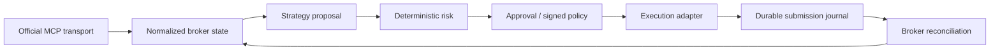
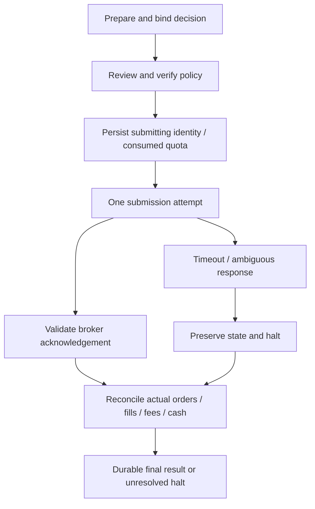

# Architecture

The project separates proposals from permission to execute. The bundled EMA trend example supplies deterministic advisory signals; neither strategy code nor model output can authorize a broker write.

## Transport and normalization

[The native bridge](../src/robinhood_agent/codex_bridge.py) uses Codex app-server authentication for the official Trading MCP. It verifies endpoint identity, connected status, tool annotations, and pinned input/output contracts. Ordinary native calls are restricted to the read allowlist; a narrowly scoped explicit review interface is separate.

[The standalone transport](../src/robinhood_agent/standalone_mcp.py) uses official Streamable HTTP and an operator-owned external OAuth helper. It supplies no login implementation or credential store and must not extract native Codex tokens. It negotiates protocol/session state, validates schemas and fails closed on unexpected receipts. This is an advanced integration boundary, not a second onboarding requirement.

[Broker normalization](../src/robinhood_agent/broker.py) handles pagination and produces account, cash, position, order, quote, execution, and fee evidence. Pinned [contracts](../src/robinhood_agent/contracts/official-1.6.2.json) describe the expected wire format. Unknown or inconsistent data halts processing.

## Strategy and risk

[Strategy](../src/robinhood_agent/strategy.py) computes signals and hypothetical proposals. [Risk](../src/robinhood_agent/risk.py) independently checks account eligibility, unleveraged capital, cash reserve, session, tradability, data age, spread, position/exposure concentration, turnover and loss boundaries. A proposal is advisory until these checks pass against fresh normalized state.

Configuration selects symbols, operating stage, state path and conservative thresholds. It cannot substitute for a signed approval, enrolled verification key, classification evidence, or deployment release.

## Execution and durable state

[The supervised lifecycle](../src/robinhood_agent/supervised.py) binds a prepared decision to exact reviewed economics and explicit approval. [Autonomous policy](../src/robinhood_agent/policy.py) binds account, deployment, strategy, config, risk, schema and universe evidence to a bounded, externally signed envelope. Canary side quotas are consumed durably before submission I/O; a canary exit derives from the tagged reconciled BUY.

[State](../src/robinhood_agent/state.py) uses a local SQLite journal, stable decision identity, unique submission reference, an OS process lock and a fenced SQLite lease. SQLite is authoritative; JSONL is an atomically regenerated export. The lease protects against stale workers even after a process loses its lock.

Acknowledgement is not a fill. Unknown submission has no automatic replay path. Recovery observes and reconciles the existing broker identity before any separately authorized continuation.

## Deployment boundary

`docs/FRAMEWORK_FREEZE.json` is an active deployment integrity manifest, not a status report. The policy verifies its file hashes and rejects unfrozen executable source. Changes to a deployment invalidate prior signed context; a new manifest alone grants no permission.

The supported stages and current release state live in [deployment.md](deployment.md). The security invariants live in [safety.md](safety.md). Public examples are separate from ignored credentials, signed operator artifacts, runtime state, and authentication caches.
